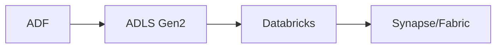
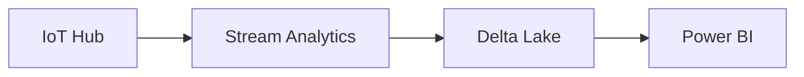
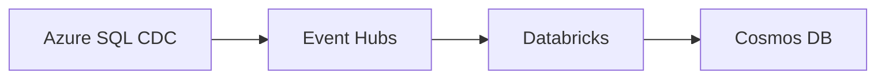
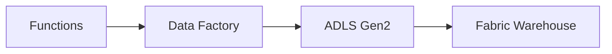
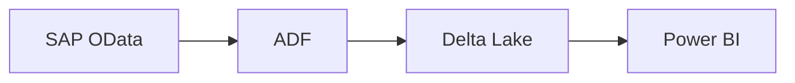
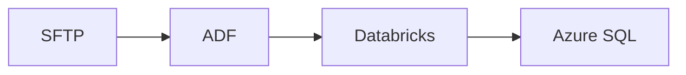
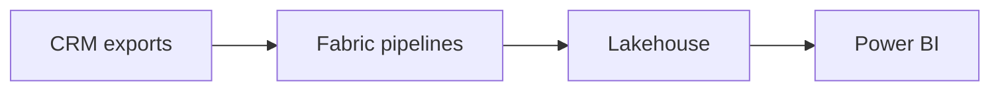
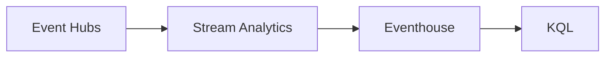
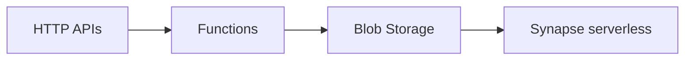
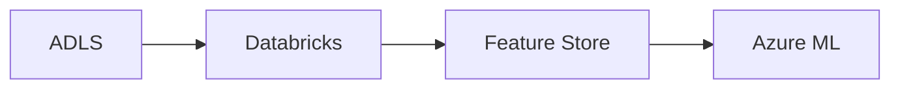

# 20 End-to-End Azure Data Engineering Projects

Reference architectures with implementation phases, trade-offs and Mermaid diagrams.

## 1. Retail batch lakehouse — scale tier 1

**Business goal:** deliver governed, replayable analytics from ADF with an explicit freshness SLA.

**Pipeline:** Land immutable raw data with source metadata; validate schema and quarantine invalid records; transform through bronze/silver/gold layers; publish an access-controlled serving model; expose freshness and quality metrics.

**Build plan:** infrastructure as code, managed identity, Key Vault, private endpoints where required, CI/CD promotion, idempotent backfill, unit and integration tests, cost budgets and an operational runbook.

**Major-project extension:** add a second source, CDC, lineage, contract testing, disaster recovery, synthetic load testing and a dashboard that proves business value.

## 2. IoT streaming telemetry — scale tier 1

**Business goal:** deliver governed, replayable analytics from IoT Hub with an explicit freshness SLA.

**Pipeline:** Land immutable raw data with source metadata; validate schema and quarantine invalid records; transform through bronze/silver/gold layers; publish an access-controlled serving model; expose freshness and quality metrics.

**Build plan:** infrastructure as code, managed identity, Key Vault, private endpoints where required, CI/CD promotion, idempotent backfill, unit and integration tests, cost budgets and an operational runbook.

**Major-project extension:** add a second source, CDC, lineage, contract testing, disaster recovery, synthetic load testing and a dashboard that proves business value.

## 3. CDC order platform — scale tier 1

**Business goal:** deliver governed, replayable analytics from Azure SQL CDC with an explicit freshness SLA.

**Pipeline:** Land immutable raw data with source metadata; validate schema and quarantine invalid records; transform through bronze/silver/gold layers; publish an access-controlled serving model; expose freshness and quality metrics.

**Build plan:** infrastructure as code, managed identity, Key Vault, private endpoints where required, CI/CD promotion, idempotent backfill, unit and integration tests, cost budgets and an operational runbook.

**Major-project extension:** add a second source, CDC, lineage, contract testing, disaster recovery, synthetic load testing and a dashboard that proves business value.

## 4. SaaS API ingestion — scale tier 1

**Business goal:** deliver governed, replayable analytics from Functions with an explicit freshness SLA.

**Pipeline:** Land immutable raw data with source metadata; validate schema and quarantine invalid records; transform through bronze/silver/gold layers; publish an access-controlled serving model; expose freshness and quality metrics.

**Build plan:** infrastructure as code, managed identity, Key Vault, private endpoints where required, CI/CD promotion, idempotent backfill, unit and integration tests, cost budgets and an operational runbook.

**Major-project extension:** add a second source, CDC, lineage, contract testing, disaster recovery, synthetic load testing and a dashboard that proves business value.

## 5. SAP incremental logistics — scale tier 1

**Business goal:** deliver governed, replayable analytics from SAP OData with an explicit freshness SLA.

**Pipeline:** Land immutable raw data with source metadata; validate schema and quarantine invalid records; transform through bronze/silver/gold layers; publish an access-controlled serving model; expose freshness and quality metrics.

**Build plan:** infrastructure as code, managed identity, Key Vault, private endpoints where required, CI/CD promotion, idempotent backfill, unit and integration tests, cost budgets and an operational runbook.

**Major-project extension:** add a second source, CDC, lineage, contract testing, disaster recovery, synthetic load testing and a dashboard that proves business value.

## 6. Finance reconciliation — scale tier 1

**Business goal:** deliver governed, replayable analytics from SFTP with an explicit freshness SLA.

**Pipeline:** Land immutable raw data with source metadata; validate schema and quarantine invalid records; transform through bronze/silver/gold layers; publish an access-controlled serving model; expose freshness and quality metrics.

**Build plan:** infrastructure as code, managed identity, Key Vault, private endpoints where required, CI/CD promotion, idempotent backfill, unit and integration tests, cost budgets and an operational runbook.

**Major-project extension:** add a second source, CDC, lineage, contract testing, disaster recovery, synthetic load testing and a dashboard that proves business value.

## 7. Customer 360 — scale tier 1

**Business goal:** deliver governed, replayable analytics from CRM exports with an explicit freshness SLA.

**Pipeline:** Land immutable raw data with source metadata; validate schema and quarantine invalid records; transform through bronze/silver/gold layers; publish an access-controlled serving model; expose freshness and quality metrics.

**Build plan:** infrastructure as code, managed identity, Key Vault, private endpoints where required, CI/CD promotion, idempotent backfill, unit and integration tests, cost budgets and an operational runbook.

**Major-project extension:** add a second source, CDC, lineage, contract testing, disaster recovery, synthetic load testing and a dashboard that proves business value.

## 8. Security log analytics — scale tier 1

**Business goal:** deliver governed, replayable analytics from Event Hubs with an explicit freshness SLA.

**Pipeline:** Land immutable raw data with source metadata; validate schema and quarantine invalid records; transform through bronze/silver/gold layers; publish an access-controlled serving model; expose freshness and quality metrics.

**Build plan:** infrastructure as code, managed identity, Key Vault, private endpoints where required, CI/CD promotion, idempotent backfill, unit and integration tests, cost budgets and an operational runbook.

**Major-project extension:** add a second source, CDC, lineage, contract testing, disaster recovery, synthetic load testing and a dashboard that proves business value.

## 9. Open data platform — scale tier 1

**Business goal:** deliver governed, replayable analytics from HTTP APIs with an explicit freshness SLA.

**Pipeline:** Land immutable raw data with source metadata; validate schema and quarantine invalid records; transform through bronze/silver/gold layers; publish an access-controlled serving model; expose freshness and quality metrics.

**Build plan:** infrastructure as code, managed identity, Key Vault, private endpoints where required, CI/CD promotion, idempotent backfill, unit and integration tests, cost budgets and an operational runbook.

**Major-project extension:** add a second source, CDC, lineage, contract testing, disaster recovery, synthetic load testing and a dashboard that proves business value.

## 10. ML feature pipeline — scale tier 1

**Business goal:** deliver governed, replayable analytics from ADLS with an explicit freshness SLA.

**Pipeline:** Land immutable raw data with source metadata; validate schema and quarantine invalid records; transform through bronze/silver/gold layers; publish an access-controlled serving model; expose freshness and quality metrics.

**Build plan:** infrastructure as code, managed identity, Key Vault, private endpoints where required, CI/CD promotion, idempotent backfill, unit and integration tests, cost budgets and an operational runbook.

**Major-project extension:** add a second source, CDC, lineage, contract testing, disaster recovery, synthetic load testing and a dashboard that proves business value.

## 11. Retail batch lakehouse — scale tier 2

**Business goal:** deliver governed, replayable analytics from ADF with an explicit freshness SLA.

**Pipeline:** Land immutable raw data with source metadata; validate schema and quarantine invalid records; transform through bronze/silver/gold layers; publish an access-controlled serving model; expose freshness and quality metrics.

**Build plan:** infrastructure as code, managed identity, Key Vault, private endpoints where required, CI/CD promotion, idempotent backfill, unit and integration tests, cost budgets and an operational runbook.

**Major-project extension:** add a second source, CDC, lineage, contract testing, disaster recovery, synthetic load testing and a dashboard that proves business value.

## 12. IoT streaming telemetry — scale tier 2

**Business goal:** deliver governed, replayable analytics from IoT Hub with an explicit freshness SLA.

**Pipeline:** Land immutable raw data with source metadata; validate schema and quarantine invalid records; transform through bronze/silver/gold layers; publish an access-controlled serving model; expose freshness and quality metrics.

**Build plan:** infrastructure as code, managed identity, Key Vault, private endpoints where required, CI/CD promotion, idempotent backfill, unit and integration tests, cost budgets and an operational runbook.

**Major-project extension:** add a second source, CDC, lineage, contract testing, disaster recovery, synthetic load testing and a dashboard that proves business value.

## 13. CDC order platform — scale tier 2

**Business goal:** deliver governed, replayable analytics from Azure SQL CDC with an explicit freshness SLA.

**Pipeline:** Land immutable raw data with source metadata; validate schema and quarantine invalid records; transform through bronze/silver/gold layers; publish an access-controlled serving model; expose freshness and quality metrics.

**Build plan:** infrastructure as code, managed identity, Key Vault, private endpoints where required, CI/CD promotion, idempotent backfill, unit and integration tests, cost budgets and an operational runbook.

**Major-project extension:** add a second source, CDC, lineage, contract testing, disaster recovery, synthetic load testing and a dashboard that proves business value.

## 14. SaaS API ingestion — scale tier 2

**Business goal:** deliver governed, replayable analytics from Functions with an explicit freshness SLA.

**Pipeline:** Land immutable raw data with source metadata; validate schema and quarantine invalid records; transform through bronze/silver/gold layers; publish an access-controlled serving model; expose freshness and quality metrics.

**Build plan:** infrastructure as code, managed identity, Key Vault, private endpoints where required, CI/CD promotion, idempotent backfill, unit and integration tests, cost budgets and an operational runbook.

**Major-project extension:** add a second source, CDC, lineage, contract testing, disaster recovery, synthetic load testing and a dashboard that proves business value.

## 15. SAP incremental logistics — scale tier 2

**Business goal:** deliver governed, replayable analytics from SAP OData with an explicit freshness SLA.

**Pipeline:** Land immutable raw data with source metadata; validate schema and quarantine invalid records; transform through bronze/silver/gold layers; publish an access-controlled serving model; expose freshness and quality metrics.

**Build plan:** infrastructure as code, managed identity, Key Vault, private endpoints where required, CI/CD promotion, idempotent backfill, unit and integration tests, cost budgets and an operational runbook.

**Major-project extension:** add a second source, CDC, lineage, contract testing, disaster recovery, synthetic load testing and a dashboard that proves business value.

## 16. Finance reconciliation — scale tier 2

**Business goal:** deliver governed, replayable analytics from SFTP with an explicit freshness SLA.

**Pipeline:** Land immutable raw data with source metadata; validate schema and quarantine invalid records; transform through bronze/silver/gold layers; publish an access-controlled serving model; expose freshness and quality metrics.

**Build plan:** infrastructure as code, managed identity, Key Vault, private endpoints where required, CI/CD promotion, idempotent backfill, unit and integration tests, cost budgets and an operational runbook.

**Major-project extension:** add a second source, CDC, lineage, contract testing, disaster recovery, synthetic load testing and a dashboard that proves business value.

## 17. Customer 360 — scale tier 2

**Business goal:** deliver governed, replayable analytics from CRM exports with an explicit freshness SLA.

**Pipeline:** Land immutable raw data with source metadata; validate schema and quarantine invalid records; transform through bronze/silver/gold layers; publish an access-controlled serving model; expose freshness and quality metrics.

**Build plan:** infrastructure as code, managed identity, Key Vault, private endpoints where required, CI/CD promotion, idempotent backfill, unit and integration tests, cost budgets and an operational runbook.

**Major-project extension:** add a second source, CDC, lineage, contract testing, disaster recovery, synthetic load testing and a dashboard that proves business value.

## 18. Security log analytics — scale tier 2

**Business goal:** deliver governed, replayable analytics from Event Hubs with an explicit freshness SLA.

**Pipeline:** Land immutable raw data with source metadata; validate schema and quarantine invalid records; transform through bronze/silver/gold layers; publish an access-controlled serving model; expose freshness and quality metrics.

**Build plan:** infrastructure as code, managed identity, Key Vault, private endpoints where required, CI/CD promotion, idempotent backfill, unit and integration tests, cost budgets and an operational runbook.

**Major-project extension:** add a second source, CDC, lineage, contract testing, disaster recovery, synthetic load testing and a dashboard that proves business value.

## 19. Open data platform — scale tier 2

**Business goal:** deliver governed, replayable analytics from HTTP APIs with an explicit freshness SLA.

**Pipeline:** Land immutable raw data with source metadata; validate schema and quarantine invalid records; transform through bronze/silver/gold layers; publish an access-controlled serving model; expose freshness and quality metrics.

**Build plan:** infrastructure as code, managed identity, Key Vault, private endpoints where required, CI/CD promotion, idempotent backfill, unit and integration tests, cost budgets and an operational runbook.

**Major-project extension:** add a second source, CDC, lineage, contract testing, disaster recovery, synthetic load testing and a dashboard that proves business value.

## 20. ML feature pipeline — scale tier 2

**Business goal:** deliver governed, replayable analytics from ADLS with an explicit freshness SLA.

**Pipeline:** Land immutable raw data with source metadata; validate schema and quarantine invalid records; transform through bronze/silver/gold layers; publish an access-controlled serving model; expose freshness and quality metrics.

**Build plan:** infrastructure as code, managed identity, Key Vault, private endpoints where required, CI/CD promotion, idempotent backfill, unit and integration tests, cost budgets and an operational runbook.

**Major-project extension:** add a second source, CDC, lineage, contract testing, disaster recovery, synthetic load testing and a dashboard that proves business value.
